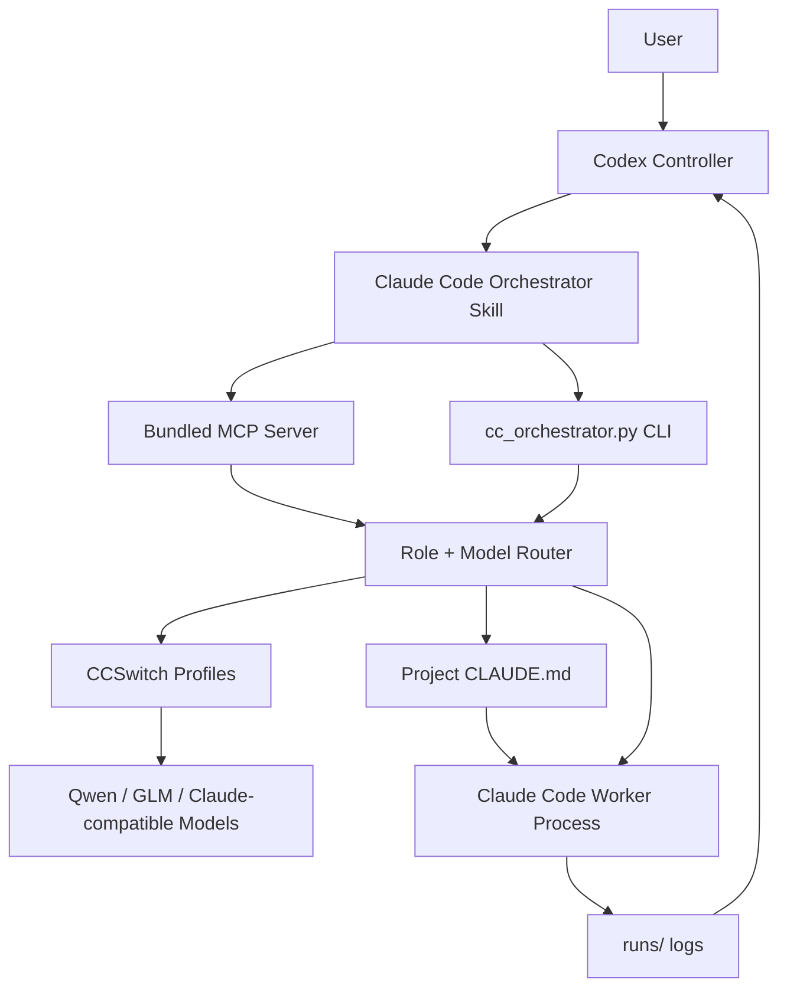

<p align="center">
  
</p>

<h1 align="center">Claude Code Orchestrator Skill</h1>

<p align="center">
  <b>A world-class multi-agent engineering harness for Codex, Claude Code, CCSwitch, and local model routing.</b>
</p>

<p align="center">
  <b>Make Plus feel like Pro.</b>
</p>

<p align="center">
  <a href="README.zh-CN.md"></a>
  <a href="LICENSE"></a>
  
  
  
</p>

<p align="center">
  中文版文档：<a href="README.zh-CN.md"><b>README.zh-CN.md</b></a>
</p>

---

<h2 align="center">Plain-English Pitch</h2>

GPT-class models are excellent.

But Plus-level quotas are not infinite.

If you spawn many internal subagents directly inside Codex, your best-model quota can disappear fast.

A deep repo audit, a parallel multi-agent review, or one ambitious refactor can burn through the budget you wanted to save for judgment.

That is why this Skill exists.

The mission:

> Make Plus feel like Pro.

This Skill turns that constraint into an engineering system:

> Let the best model act as the brain.  
> Let Claude Code plus your CCSwitch models act as hands.  
> Let Codex stay in control.

In other words:

> Codex does not need to do every low-level subtask itself.  
> Codex plans, routes, supervises, and verifies.  
> Claude Code executes through external worker models.

This is a miniature cost-management operating system for multi-agent coding.

<h2 align="center">What It Is</h2>

`claude-code-orchestrator-skill` is a Codex Skill with a bundled MCP server and CLI.

It lets Codex:

- discover local Claude Code
- read CCSwitch profiles
- find all configured Claude-compatible models
- score models by role
- route agents to the best local model
- launch Claude Code as an external worker
- keep runs read-only by default
- save run metadata and logs
- expose everything through MCP tools
- handle Windows UTF-8 output safely
- write a project `CLAUDE.md` so Claude Code workers receive stable role/persona instructions

<h2 align="center">Requirements</h2>

You need:

1. **Codex**
2. **Claude Code**
3. **CCSwitch**
4. **Multiple models configured inside CCSwitch**
5. **Python 3.10+**

The Skill is most powerful when CCSwitch has several models with different strengths:

- strong reasoning model
- strong code model
- fast cheap model
- review/security model
- fallback model

<h2 align="center">One-Line Agent Install Prompt</h2>

Paste this into Codex:

```text
Install the Codex Skill and MCP server from https://github.com/chu459/claude-code-orchestrator-skill. Put the Skill at ~/.codex/skills/claude-code-orchestrator, wire the bundled MCP server into Codex config.toml, run selftest, healthcheck, score-models, and show me the selected multi-agent routing plan. Do not print secrets.
```

<h2 align="center">Install</h2>

Windows PowerShell:

```powershell
$tmp = Join-Path $env:TEMP "claude-code-orchestrator-skill.zip"; `
iwr -UseBasicParsing "https://github.com/chu459/claude-code-orchestrator-skill/archive/refs/heads/main.zip" -OutFile $tmp; `
$dir = Join-Path $env:TEMP "claude-code-orchestrator-skill"; `
if (Test-Path $dir) { Remove-Item $dir -Recurse -Force }; `
Expand-Archive $tmp -DestinationPath $dir -Force; `
& (Get-ChildItem $dir -Recurse -Filter install.ps1 | Select-Object -First 1).FullName
```

macOS / Linux:

```bash
tmp="$(mktemp -d)" && \
curl -L "https://github.com/chu459/claude-code-orchestrator-skill/archive/refs/heads/main.zip" -o "$tmp/skill.zip" && \
unzip -q "$tmp/skill.zip" -d "$tmp" && \
bash "$tmp"/claude-code-orchestrator-skill-main/install/install.sh
```

<h2 align="center">MCP Setup</h2>

Add this to Codex `config.toml`:

```toml
[mcp_servers.claude-code-orchestrator]
command = "python"
args = [
  "-c",
  "import os,sys,runpy; home=os.environ.get('CODEX_HOME') or os.path.join(os.environ.get('USERPROFILE') or os.path.expanduser('~'), '.codex'); root=os.environ.get('CC_ORCHESTRATOR_HOME') or os.path.join(home, 'skills', 'claude-code-orchestrator', 'scripts', 'cc-orchestrator'); sys.path.insert(0, root); runpy.run_path(os.path.join(root, 'server.py'), run_name='__main__')"
]

[mcp_servers.claude-code-orchestrator.env]
PYTHONIOENCODING = "utf-8"
PYTHONUTF8 = "1"
```

<h2 align="center">Quick Check</h2>

```bash
export CC_ORCHESTRATOR_HOME="$HOME/.codex/skills/claude-code-orchestrator/scripts/cc-orchestrator"
python "$CC_ORCHESTRATOR_HOME/cc_orchestrator.py" selftest
python "$CC_ORCHESTRATOR_HOME/cc_orchestrator.py" healthcheck
python "$CC_ORCHESTRATOR_HOME/cc_orchestrator.py" score-models
```

<h2 align="center">Common Commands</h2>

Healthcheck:

```bash
python "$CC_ORCHESTRATOR_HOME/cc_orchestrator.py" healthcheck
```

List CCSwitch profiles:

```bash
python "$CC_ORCHESTRATOR_HOME/cc_orchestrator.py" list-profiles
```

Score local models:

```bash
python "$CC_ORCHESTRATOR_HOME/cc_orchestrator.py" score-models
```

Write strategy reports:

```bash
python "$CC_ORCHESTRATOR_HOME/cc_orchestrator.py" write-reports
```

Write a `CLAUDE.md` worker persona into a project:

```bash
python "$CC_ORCHESTRATOR_HOME/cc_orchestrator.py" write-claude-md --cwd /path/to/project --role implementation
```

Run a read-only architecture worker:

```bash
python "$CC_ORCHESTRATOR_HOME/cc_orchestrator.py" run "Map this repository architecture" --role architecture
```

Run a streaming background worker:

```bash
python "$CC_ORCHESTRATOR_HOME/cc_orchestrator.py" run-streaming "Review this repository" --role review
```

Poll, list, or stop workers:

```bash
python "$CC_ORCHESTRATOR_HOME/cc_orchestrator.py" poll-run --run-id <run_id>
python "$CC_ORCHESTRATOR_HOME/cc_orchestrator.py" run-status
python "$CC_ORCHESTRATOR_HOME/cc_orchestrator.py" stop-run --run-id <run_id> --force
```

Spawn and collect a role team:

```bash
python "$CC_ORCHESTRATOR_HOME/cc_orchestrator.py" spawn-role-team "Audit this repository" --roles requirements,architecture,security,testing
python "$CC_ORCHESTRATOR_HOME/cc_orchestrator.py" collect-team-results --team-id <team_id>
python "$CC_ORCHESTRATOR_HOME/cc_orchestrator.py" cross-review --run-id <run_id> --run-id <run_id>
```

Safety and acceptance helpers:

```bash
python "$CC_ORCHESTRATOR_HOME/cc_orchestrator.py" preflight-write-scope --cwd /path/to/project --allow src --deny .env --max-diff-lines 800
python "$CC_ORCHESTRATOR_HOME/cc_orchestrator.py" diff-summary --cwd /path/to/project
python "$CC_ORCHESTRATOR_HOME/cc_orchestrator.py" secret-scan-run --run-id <run_id>
```

Scheduling and reporting:

```bash
python "$CC_ORCHESTRATOR_HOME/cc_orchestrator.py" benchmark-model --profile PROFILE --execute
python "$CC_ORCHESTRATOR_HOME/cc_orchestrator.py" calibrate-policy --preference coding=glm-5 --preference multimodal=qwen3.7-plus
python "$CC_ORCHESTRATOR_HOME/cc_orchestrator.py" cost-guard --max-concurrent 4 --max-timeout-seconds 1200 --apply
python "$CC_ORCHESTRATOR_HOME/cc_orchestrator.py" dashboard
python "$CC_ORCHESTRATOR_HOME/cc_orchestrator.py" export-report --run-id <run_id>
```

Open a visible Claude Code worker window:

```bash
python "$CC_ORCHESTRATOR_HOME/cc_orchestrator.py" run-visible "Inspect this repository" --role architecture
```

Inspect the latest run:

```bash
python "$CC_ORCHESTRATOR_HOME/cc_orchestrator.py" last-run
```

<h2 align="center">Included MCP Tools</h2>

| Tool | Purpose |
| --- | --- |
| `cc_healthcheck` | Check Claude Code, CCSwitch, config |
| `cc_list_profiles` | List CCSwitch profiles |
| `cc_pick_profile` | Pick a profile/model for a role |
| `cc_run_agent` | Run a Claude Code worker |
| `cc_run_streaming_agent` | Start a background Claude Code worker with `stream-json` events |
| `cc_poll_run` | Poll one run for status, output deltas, tool calls, phase, and elapsed time |
| `cc_stop_run` | Stop a specific running Claude Code worker |
| `cc_run_status` | List active Claude Code workers or inspect one run |
| `cc_send_instruction` | Stop and restart a run with recovered context and a new instruction |
| `cc_spawn_role_team` | Start several role workers at once |
| `cc_collect_team_results` | Summarize team output and mark agreements/conflicts |
| `cc_cross_review` | Launch second-round reviewer workers |
| `cc_preflight_write_scope` | Fix allowed paths, denied paths, and max diff before writes |
| `cc_diff_summary` | Summarize changed files, risks, and test need |
| `cc_secret_scan_run` | Scan run logs/events/diff for leaked secrets |
| `cc_rollback_run` | Conservative rollback when git snapshots prove it is safe |
| `cc_benchmark_model` | Run or plan a small model benchmark |
| `cc_calibrate_policy` | Persist local model preference notes |
| `cc_cost_guard` | Configure max concurrency and timeout guardrails |
| `cc_dashboard` | Generate a local HTML worker dashboard |
| `cc_open_run_folder` | Open or return a run log folder |
| `cc_export_report` | Export a run or team Markdown report |
| `cc_run_visible_agent` | Open a visible Claude Code worker |
| `cc_last_run` | Inspect last run |
| `cc_git_diff` | Inspect git diff |
| `cc_workflow_plan` | Build a multi-agent workflow plan |
| `cc_write_claude_md` | Write a project `CLAUDE.md` for Claude Code worker behavior |
| `cc_score_models` | Score local models |
| `cc_write_strategy_reports` | Write score and routing reports |

<h2 align="center">Configuring CLAUDE.md for Claude Code Workers</h2>

Claude Code can read a project-level `CLAUDE.md` file.

This is extremely useful for orchestration, because Codex can set the worker's persona before launching it.

The generated `CLAUDE.md` tells Claude Code:

- Codex is the controller, planner, reviewer, and final decision maker
- Claude Code is an external worker process
- the assigned role, such as `architecture`, `implementation`, or `review`
- safety rules about secrets, destructive commands, and unrelated changes
- progress-reporting rules for long-running work

Create one:

```bash
python "$CC_ORCHESTRATOR_HOME/cc_orchestrator.py" write-claude-md --cwd /path/to/project --role review
```

If the project already has `CLAUDE.md`, the command is conservative:

- default: do not overwrite
- `--append`: append the orchestrator-managed section
- `--force`: replace after writing a timestamped backup

Through MCP, Codex can call:

```text
cc_write_claude_md
```

Recommended flow:

```text
1. Codex plans the work
2. Codex writes CLAUDE.md for the selected worker role
3. Codex launches Claude Code through this Skill
4. Claude Code follows the project persona and role rules
5. Codex reviews logs, diffs, and final output
```

<h2 align="center">Multi-Agent Roles</h2>

| Role | Purpose |
| --- | --- |
| `requirements` | Requirements, scope, non-goals, acceptance criteria |
| `architecture` | Repository map, likely files, implementation strategy, risks |
| `security` | Secrets, permissions, command risk, supply-chain risk |
| `testing` | Validation commands, expected signals, residual risk |
| `implementation` | Scoped edits when write access is explicitly allowed |
| `review` | Findings ordered by severity, file references, open questions |
| `ops` | Deployment, logs, rollback, runtime risk |

<h2 align="center">The Core Idea</h2>

This project is not just “spawn more agents”.

It is:

```text
Brain: best model for judgment
Hands: cheaper/faster worker models for execution
Ledger: every run saved
Manager: Codex controls the flow
```

That is why it is a cost-management harness.

<h2 align="center">Architecture</h2>



<h2 align="center">Safety Defaults</h2>

The default posture is intentionally conservative:

- read-only planning by default
- `permission_mode = plan` unless write access is explicitly enabled
- `allow_write=true` required for scoped implementation work
- no global CCSwitch mutation
- secrets are redacted from tool output and persisted logs
- UTF-8-safe output on Windows
- timeout output is preserved when Python exposes partial stdout/stderr
- existing `CLAUDE.md` files are not overwritten unless `--append` or `--force` is used

<h2 align="center">Live Progress</h2>

What works today:

1. use `run-streaming` to start Claude Code with `--output-format stream-json --include-partial-messages`
2. read live events from `events.ndjson`
3. use `poll-run` to inspect one run's status, stdout/stderr deltas, latest phase, and tool calls
4. use `run-status` to list active workers
5. use `stop-run` to terminate a runaway worker
6. use `run-visible` when the user wants a real terminal window

Windows:

```powershell
Get-Content "$env:CC_ORCHESTRATOR_HOME\runs\<run_id>\stdout.txt" -Wait
Get-Content "$env:CC_ORCHESTRATOR_HOME\runs\<run_id>\events.ndjson" -Wait
```

macOS / Linux:

```bash
tail -f "$CC_ORCHESTRATOR_HOME/runs/<run_id>/stdout.txt"
tail -f "$CC_ORCHESTRATOR_HOME/runs/<run_id>/events.ndjson"
```

The P0 live-control loop is:

```text
cc_run_streaming_agent -> events.ndjson
cc_poll_run -> latest output, tool calls, phase, elapsed time
cc_run_status -> active worker list
cc_stop_run -> kill a stuck or expensive worker
```

Full design notes:

```text
docs/realtime-progress.md
```

<h2 align="center">Open-Source Position</h2>

The goal is intentionally ambitious:

> Become one of the world's top multi-agent collaboration harnesses: strong models as the brain, cheaper models as hands, Codex as controller, and MCP as the nervous system.

This is not about spectacle.

It is about bringing model cost, context cost, worker cost, and human attention cost into one auditable engineering loop.

<h2 align="center">Roadmap</h2>

- [x] Codex Skill
- [x] Bundled MCP Server
- [x] CCSwitch profile discovery
- [x] Local model scoring
- [x] Role-based model routing
- [x] Claude Code subprocess launching
- [x] Visible Claude Code window
- [x] UTF-8 safe Windows output
- [x] Run logs and `last-run`
- [x] `CLAUDE.md` worker persona writer
- [x] Live event stream with `events.ndjson`
- [x] Poll/stop/status tools for live control
- [x] Role team spawning and result collection
- [x] Cross-review worker loop
- [x] Preflight write-scope file
- [x] Diff summary and secret scan helpers
- [x] Conservative rollback helper
- [x] Model benchmark/calibration entrypoints
- [x] Cost guard policy
- [x] Local HTML dashboard
- [ ] Web dashboard
- [ ] Agent result voting

<h2 align="center">License</h2>

MIT.

<h2 align="center">Attribution</h2>

Not affiliated with OpenAI, Anthropic, Claude, Claude Code, or CCSwitch.
