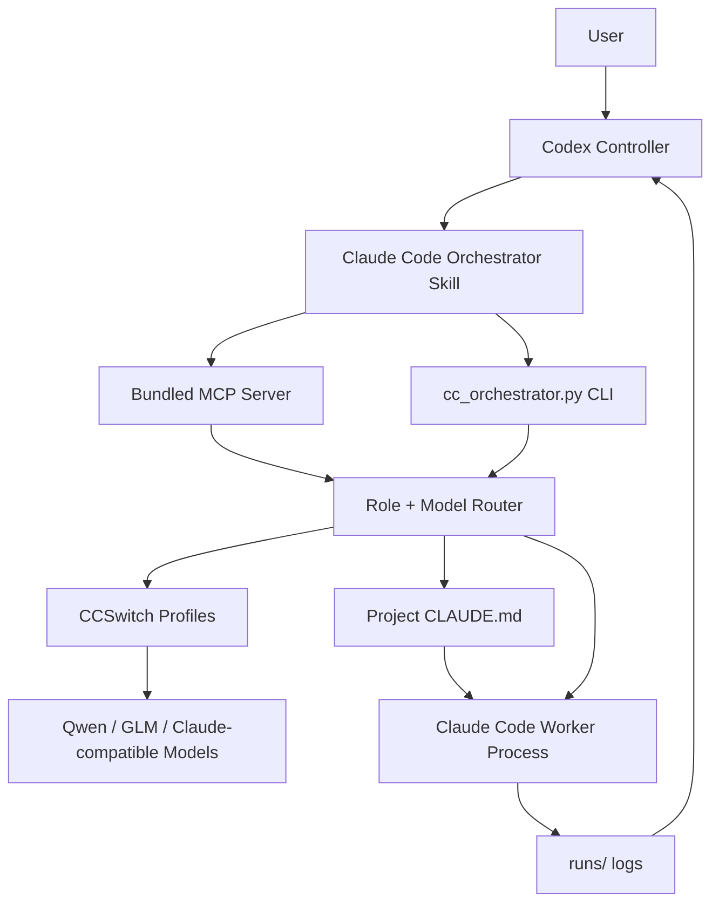

<p align="center">
  
</p>

<h1 align="center">Claude Code Orchestrator Skill</h1>

<p align="center">
  <b>A world-class multi-agent engineering harness for Codex, Claude Code, CCSwitch, and local model routing.</b>
</p>

<p align="center">
  <b>Make Plus feel like Pro.</b>
</p>

<p align="center">
  <a href="README.zh-CN.md"></a>
  <a href="LICENSE"></a>
  
  
  
  
</p>

<p align="center">
  中文版文档：<a href="README.zh-CN.md"><b>README.zh-CN.md</b></a>
</p>

---

<h2 align="center">Latest Updates</h2>

<p align="center">
  <b>Current version: v0.4.1</b>
</p>

| Version | What changed | Why it matters |
| --- | --- | --- |
| `v0.4.1` | Added rolling `checkpoint-###.md` summaries, deduplicated tool-call summaries, default artifact-writing controller poll, and exact `queued/running/done/failed` queue states. | Codex can now inspect only decision-grade summaries while workers keep raw audit logs on disk. |
| `v0.4.0` | Added the Codex Controller Playbook, Prompt Pack, compact controller-mode polling, `cc_summarize_run`, `cc_compact_events`, one-click verification scoring, real queue policy, model registry, local override preservation, worker quality history, failure-mode detection, and timeline dashboard. | Codex can now manage Claude Code workers like a real controller: watch compact progress, stop bad runs, verify changes, learn which model is best, and preserve local preferences across upgrades. |
| `v0.3.0` | Added `cc_verify_run`, hard write-scope checks, mock streaming E2E tests, queue scheduling, usage summaries, upgrade checks, MCP auto-registration, and benchmark suite. | Turns the project from “can run workers” into a safer control console with verification, migration, and low-cost testing. |
| `v0.2.x` | Added live streaming control: `run-streaming`, `poll-run`, `stop-run`, `run-status`, team spawning, cross review, dashboard, reports, and cost guard. | Codex can watch and manage Claude Code workers in real time instead of waiting blindly. |
| `v0.1.x` | Built the first Skill + MCP + CLI foundation with CCSwitch profile discovery, model scoring, role routing, `CLAUDE.md` generation, visible Claude Code windows, logs, and safe defaults. | Proved the core idea: Codex is the brain, Claude Code is the worker layer, CCSwitch is the local model router. |

<h3 align="center">Detailed Version Notes</h3>

<details open>
<summary><b>v0.4.1 - Controller Checkpoints, Tool Dedup, Queue State Polish</b></summary>

- Added rolling `checkpoints/checkpoint-###.md` files for long-running Claude Code workers.
- Each checkpoint records what is done, what was found, what changed, what remains, and whether the worker is drifting.
- Added deduplicated tool-call summaries, such as `Grep x7` and `Read x3`.
- Made controller-mode `poll-run` write controller artifacts by default.
- Added `last_meaningful_action`, `new_findings`, `tool_call_summary`, and `controller_attention_flags` to controller summaries.
- Changed queue success state to `done`, with explicit `queued`, `running`, `done`, `failed`, `timed_out`, and `cancelled` states.
- Polished the local HTML dashboard with top model routing, left worker list, center timeline/logs, and right diff/risk/control commands.

</details>

<details open>
<summary><b>v0.4.0 - Codex Controller System</b></summary>

- Added `references/codex-controller-playbook.md`, the dedicated Codex scheduling manual.
- Documented when Codex should work directly and when it should delegate to Claude Code.
- Documented poll cadence, stop signals, cross-review rules, write-permission rules, and verification gates.
- Added Prompt Pack templates: `repo-audit`, `bugfix`, `security-audit`, `frontend-polish`, `test-generation`, `refactor-plan`, and `release-check`.
- Added `cc_poll_run --mode controller` for compact controller summaries instead of raw event dumps.
- Added `cc_summarize_run` and `cc_compact_events`.
- Added controller artifacts: `progress_summary.json`, `latest_decision.md`, `risk_flags.json`, `changed_files.json`, and `tool_timeline.md`.
- Added real queue policy support with max concurrency, priority, retry policy, timeout policy, and state summaries.
- Added `model_registry.json` and `model_benchmark_history.json` support.
- Added `local_policy.override.json` so local preferences survive GitHub updates.
- Added worker quality scoring history for solved status, scope safety, secret safety, failure flags, token usage, hallucination, and rework.
- Added automatic failure-mode detection for stalled workers, repeated search, excessive output, destructive command risk, test failure plus success claims, write-scope violations, and secret-like output.
- Added model registry aggregation from CCSwitch scans, benchmark history, and worker quality history.
- Added MCP tools for model registry, local policy, worker scoring, Prompt Pack rendering, queue policy, compact events, and run summaries.
- Added daily Codex automation guidance for checking GitHub updates without auto-applying them.

</details>

<details>
<summary><b>v0.3.0 - Verification, Packaging, and Safer Operations</b></summary>

- Added one-click `cc_verify_run`.
- Chained diff summary, write-scope check, secret scan, optional test commands, and Markdown report into the acceptance flow.
- Added hard write-scope enforcement after runs.
- Added a conservative rollback helper based on git snapshots.
- Added mock streaming end-to-end tests, so streaming can be tested without spending model quota.
- Added benchmark suite entrypoints for code, review, security, long-context, and multimodal planning tasks.
- Added daily usage summaries from saved run logs.
- Added upgrade and version state tracking.
- Added Windows MCP auto-registration installer.
- Added stronger install preservation rules for local config.
- Added `version.json` as a single version metadata source.

</details>

<details>
<summary><b>v0.2.x - Live Worker Control</b></summary>

- Added `run-streaming` / `cc_run_streaming_agent`.
- Started Claude Code with `--output-format stream-json --include-partial-messages`.
- Wrote live `events.ndjson` files for each run.
- Added `poll-run`, `run-status`, and `stop-run`.
- Added role team spawning.
- Added team result collection.
- Added cross-review worker loops.
- Added run reports and export flow.
- Added local HTML dashboard foundation.
- Added cost guard settings for concurrency and timeout.
- Added visible Claude Code worker window support.

</details>

<details>
<summary><b>v0.1.x - Skill, MCP, CLI, and CCSwitch Foundation</b></summary>

- Created the Codex Skill entrypoint.
- Added bundled MCP server.
- Added CLI orchestrator.
- Added CCSwitch profile discovery.
- Added Claude Code binary discovery.
- Added local model scoring by role.
- Added role-based model routing.
- Added default read-only planning mode.
- Added Claude Code subprocess execution.
- Added run metadata, prompt, stdout, stderr, and last-run logs.
- Added `CLAUDE.md` worker persona generation.
- Added UTF-8-safe Windows output handling.
- Added safe secret redaction defaults.
- Added English and Chinese README foundation.

</details>

<h2 align="center">Plain-English Pitch</h2>

GPT-class models are excellent.

But Plus-level quotas are not infinite.

If you spawn many internal subagents directly inside Codex, your best-model quota can disappear fast.

A deep repo audit, a parallel multi-agent review, or one ambitious refactor can burn through the budget you wanted to save for judgment.

That is why this Skill exists.

The mission:

> Make Plus feel like Pro.

This Skill turns that constraint into an engineering system:

> Let the best model act as the brain.  
> Let Claude Code plus your CCSwitch models act as hands.  
> Let Codex stay in control.

In other words:

> Codex does not need to do every low-level subtask itself.  
> Codex plans, routes, supervises, and verifies.  
> Claude Code executes through external worker models.

This is a miniature cost-management operating system for multi-agent coding.

<h2 align="center">What It Is</h2>

`claude-code-orchestrator-skill` is a Codex Skill with a bundled MCP server and CLI.

It lets Codex:

- discover local Claude Code
- read CCSwitch profiles
- find all configured Claude-compatible models
- score models by role
- route agents to the best local model
- launch Claude Code as an external worker
- keep runs read-only by default
- save run metadata and logs
- expose everything through MCP tools
- handle Windows UTF-8 output safely
- write a project `CLAUDE.md` so Claude Code workers receive stable role/persona instructions

<h2 align="center">Requirements</h2>

You need:

1. **Codex**
2. **Claude Code**
3. **CCSwitch**
4. **Multiple models configured inside CCSwitch**
5. **Python 3.10+**

The Skill is most powerful when CCSwitch has several models with different strengths:

- strong reasoning model
- strong code model
- fast cheap model
- review/security model
- fallback model

<h2 align="center">One-Line Agent Install Prompt</h2>

Paste this into Codex:

```text
Install the Codex Skill and MCP server from https://github.com/chu459/claude-code-orchestrator-skill. Put the Skill at ~/.codex/skills/claude-code-orchestrator, wire the bundled MCP server into Codex config.toml, run selftest, healthcheck, score-models, and show me the selected multi-agent routing plan. Do not print secrets.
```

<h2 align="center">Install</h2>

Windows PowerShell:

```powershell
$tmp = Join-Path $env:TEMP "claude-code-orchestrator-skill.zip"; `
iwr -UseBasicParsing "https://github.com/chu459/claude-code-orchestrator-skill/archive/refs/heads/main.zip" -OutFile $tmp; `
$dir = Join-Path $env:TEMP "claude-code-orchestrator-skill"; `
if (Test-Path $dir) { Remove-Item $dir -Recurse -Force }; `
Expand-Archive $tmp -DestinationPath $dir -Force; `
& (Get-ChildItem $dir -Recurse -Filter install.ps1 | Select-Object -First 1).FullName
```

macOS / Linux:

```bash
tmp="$(mktemp -d)" && \
curl -L "https://github.com/chu459/claude-code-orchestrator-skill/archive/refs/heads/main.zip" -o "$tmp/skill.zip" && \
unzip -q "$tmp/skill.zip" -d "$tmp" && \
bash "$tmp"/claude-code-orchestrator-skill-main/install/install.sh
```

<h2 align="center">MCP Setup</h2>

Add this to Codex `config.toml`:

```toml
[mcp_servers.claude-code-orchestrator]
command = "python"
args = [
  "-c",
  "import os,sys,runpy; home=os.environ.get('CODEX_HOME') or os.path.join(os.environ.get('USERPROFILE') or os.path.expanduser('~'), '.codex'); root=os.environ.get('CC_ORCHESTRATOR_HOME') or os.path.join(home, 'skills', 'claude-code-orchestrator', 'scripts', 'cc-orchestrator'); sys.path.insert(0, root); runpy.run_path(os.path.join(root, 'server.py'), run_name='__main__')"
]

[mcp_servers.claude-code-orchestrator.env]
PYTHONIOENCODING = "utf-8"
PYTHONUTF8 = "1"
```

Or let the safe installer write Codex/Claude MCP config after backing up existing files:

```powershell
powershell -ExecutionPolicy Bypass -File .\install\install-mcp.ps1
```

<h2 align="center">Quick Check</h2>

```bash
export CC_ORCHESTRATOR_HOME="$HOME/.codex/skills/claude-code-orchestrator/scripts/cc-orchestrator"
python "$CC_ORCHESTRATOR_HOME/cc_orchestrator.py" selftest
python "$CC_ORCHESTRATOR_HOME/cc_orchestrator.py" healthcheck
python "$CC_ORCHESTRATOR_HOME/cc_orchestrator.py" score-models
```

<h2 align="center">Common Commands</h2>

Healthcheck:

```bash
python "$CC_ORCHESTRATOR_HOME/cc_orchestrator.py" healthcheck
```

List CCSwitch profiles:

```bash
python "$CC_ORCHESTRATOR_HOME/cc_orchestrator.py" list-profiles
```

Score local models:

```bash
python "$CC_ORCHESTRATOR_HOME/cc_orchestrator.py" score-models
```

Write strategy reports:

```bash
python "$CC_ORCHESTRATOR_HOME/cc_orchestrator.py" write-reports
```

Write a `CLAUDE.md` worker persona into a project:

```bash
python "$CC_ORCHESTRATOR_HOME/cc_orchestrator.py" write-claude-md --cwd /path/to/project --role implementation
```

Run a read-only architecture worker:

```bash
python "$CC_ORCHESTRATOR_HOME/cc_orchestrator.py" run "Map this repository architecture" --role architecture
```

Run a streaming background worker:

```bash
python "$CC_ORCHESTRATOR_HOME/cc_orchestrator.py" run-streaming "Review this repository" --role review
```

Poll, list, or stop workers:

```bash
python "$CC_ORCHESTRATOR_HOME/cc_orchestrator.py" poll-run --run-id <run_id>
python "$CC_ORCHESTRATOR_HOME/cc_orchestrator.py" run-status
python "$CC_ORCHESTRATOR_HOME/cc_orchestrator.py" stop-run --run-id <run_id> --force
```

Spawn and collect a role team:

```bash
python "$CC_ORCHESTRATOR_HOME/cc_orchestrator.py" spawn-role-team "Audit this repository" --roles requirements,architecture,security,testing
python "$CC_ORCHESTRATOR_HOME/cc_orchestrator.py" collect-team-results --team-id <team_id>
python "$CC_ORCHESTRATOR_HOME/cc_orchestrator.py" cross-review --run-id <run_id> --run-id <run_id>
```

Safety and acceptance helpers:

```bash
python "$CC_ORCHESTRATOR_HOME/cc_orchestrator.py" preflight-write-scope --cwd /path/to/project --allow src --deny .env --max-diff-lines 800
python "$CC_ORCHESTRATOR_HOME/cc_orchestrator.py" check-write-scope --cwd /path/to/project
python "$CC_ORCHESTRATOR_HOME/cc_orchestrator.py" diff-summary --cwd /path/to/project
python "$CC_ORCHESTRATOR_HOME/cc_orchestrator.py" secret-scan-run --run-id <run_id>
python "$CC_ORCHESTRATOR_HOME/cc_orchestrator.py" verify-run --run-id <run_id> --test-command "npm test"
```

Scheduling and reporting:

```bash
python "$CC_ORCHESTRATOR_HOME/cc_orchestrator.py" benchmark-model --profile PROFILE --execute
python "$CC_ORCHESTRATOR_HOME/cc_orchestrator.py" benchmark-suite --profile PROFILE
python "$CC_ORCHESTRATOR_HOME/cc_orchestrator.py" calibrate-policy --preference coding=glm-5 --preference multimodal=qwen3.7-plus
python "$CC_ORCHESTRATOR_HOME/cc_orchestrator.py" cost-guard --max-concurrent 4 --max-timeout-seconds 1200 --apply
python "$CC_ORCHESTRATOR_HOME/cc_orchestrator.py" usage-summary --write-report
python "$CC_ORCHESTRATOR_HOME/cc_orchestrator.py" queue-submit "Review this repo" --role review --priority 100
python "$CC_ORCHESTRATOR_HOME/cc_orchestrator.py" queue-tick --max-concurrent 3
python "$CC_ORCHESTRATOR_HOME/cc_orchestrator.py" queue-policy --max-concurrent 3 --default-timeout-seconds 900 --apply
python "$CC_ORCHESTRATOR_HOME/cc_orchestrator.py" model-registry --refresh --apply
python "$CC_ORCHESTRATOR_HOME/cc_orchestrator.py" local-policy --preference development=GLM5.2 --preference multimodal=qwen3.7-plus --apply
python "$CC_ORCHESTRATOR_HOME/cc_orchestrator.py" score-worker --run-id <run_id>
python "$CC_ORCHESTRATOR_HOME/cc_orchestrator.py" summarize-run --run-id <run_id>
python "$CC_ORCHESTRATOR_HOME/cc_orchestrator.py" render-prompt --template bugfix --task "Fix the bug"
python "$CC_ORCHESTRATOR_HOME/cc_orchestrator.py" upgrade-check --apply
python "$CC_ORCHESTRATOR_HOME/cc_orchestrator.py" mock-stream-test
python "$CC_ORCHESTRATOR_HOME/cc_orchestrator.py" dashboard
python "$CC_ORCHESTRATOR_HOME/cc_orchestrator.py" export-report --run-id <run_id>
```

Open a visible Claude Code worker window:

```bash
python "$CC_ORCHESTRATOR_HOME/cc_orchestrator.py" run-visible "Inspect this repository" --role architecture
```

Inspect the latest run:

```bash
python "$CC_ORCHESTRATOR_HOME/cc_orchestrator.py" last-run
```

<h2 align="center">Included MCP Tools</h2>

| Tool | Purpose |
| --- | --- |
| `cc_healthcheck` | Check Claude Code, CCSwitch, config |
| `cc_list_profiles` | List CCSwitch profiles |
| `cc_pick_profile` | Pick a profile/model for a role |
| `cc_run_agent` | Run a Claude Code worker |
| `cc_run_streaming_agent` | Start a background Claude Code worker with `stream-json` events |
| `cc_poll_run` | Poll one run in compact controller mode by default; raw deltas are still available |
| `cc_summarize_run` | Write and return controller artifacts plus rolling checkpoints |
| `cc_compact_events` | Compact raw `events.ndjson` into a small timeline and deduplicated tool summary |
| `cc_stop_run` | Stop a specific running Claude Code worker |
| `cc_run_status` | List active Claude Code workers or inspect one run |
| `cc_send_instruction` | Stop and restart a run with recovered context and a new instruction |
| `cc_spawn_role_team` | Start several role workers at once |
| `cc_collect_team_results` | Summarize team output and mark agreements/conflicts |
| `cc_cross_review` | Launch second-round reviewer workers |
| `cc_preflight_write_scope` | Fix allowed paths, denied paths, and max diff before writes |
| `cc_check_write_scope` | Block acceptance when a run changed files outside the write scope |
| `cc_diff_summary` | Summarize changed files, risks, and test need |
| `cc_secret_scan_run` | Scan run logs/events/diff for leaked secrets |
| `cc_rollback_run` | Conservative rollback when git snapshots prove it is safe |
| `cc_verify_run` | Run diff summary, scope check, secret scan, tests, and report |
| `cc_benchmark_model` | Run or plan a small model benchmark |
| `cc_benchmark_suite` | Run or plan fixed code/review/security/context/multimodal benchmarks |
| `cc_model_registry` | Build the local model capability database |
| `cc_calibrate_policy` | Persist local model preference notes |
| `cc_local_policy` | Read or write user-owned routing overrides preserved across upgrades |
| `cc_score_worker` | Grade one worker run and update quality history |
| `cc_prompt_pack` | List or render reusable worker prompts |
| `cc_cost_guard` | Configure max concurrency and timeout guardrails |
| `cc_usage_summary` | Estimate daily tokens, duration, failures, and model usage |
| `cc_queue_submit` | Submit a priority worker job |
| `cc_queue_tick` | Start queued jobs up to the concurrency limit |
| `cc_queue_status` | Inspect `queued`, `running`, `done`, `failed`, `timed_out`, and `cancelled` jobs |
| `cc_queue_cancel` | Cancel a queued or running job |
| `cc_queue_policy` | Read or write queue concurrency, retry, and timeout policy |
| `cc_upgrade_check` | Preserve local model preferences across upgrades |
| `cc_mock_stream_test` | Test streaming/poll/stop/status with a fake Claude stream |
| `cc_dashboard` | Generate a local HTML worker dashboard |
| `cc_open_run_folder` | Open or return a run log folder |
| `cc_export_report` | Export a run or team Markdown report |
| `cc_run_visible_agent` | Open a visible Claude Code worker |
| `cc_last_run` | Inspect last run |
| `cc_git_diff` | Inspect git diff |
| `cc_workflow_plan` | Build a multi-agent workflow plan |
| `cc_write_claude_md` | Write a project `CLAUDE.md` for Claude Code worker behavior |
| `cc_score_models` | Score local models |
| `cc_write_strategy_reports` | Write score and routing reports |

<h2 align="center">Configuring CLAUDE.md for Claude Code Workers</h2>

Claude Code can read a project-level `CLAUDE.md` file.

This is extremely useful for orchestration, because Codex can set the worker's persona before launching it.

The generated `CLAUDE.md` tells Claude Code:

- Codex is the controller, planner, reviewer, and final decision maker
- Claude Code is an external worker process
- the assigned role, such as `architecture`, `implementation`, or `review`
- safety rules about secrets, destructive commands, and unrelated changes
- progress-reporting rules for long-running work

Create one:

```bash
python "$CC_ORCHESTRATOR_HOME/cc_orchestrator.py" write-claude-md --cwd /path/to/project --role review
```

If the project already has `CLAUDE.md`, the command is conservative:

- default: do not overwrite
- `--append`: append the orchestrator-managed section
- `--force`: replace after writing a timestamped backup

Through MCP, Codex can call:

```text
cc_write_claude_md
```

Recommended flow:

```text
1. Codex plans the work
2. Codex writes CLAUDE.md for the selected worker role
3. Codex launches Claude Code through this Skill
4. Claude Code follows the project persona and role rules
5. Codex reviews logs, diffs, and final output
```

<h2 align="center">Daily Update Monitor</h2>

You can ask Codex to create a daily automation that checks `chu459/claude-code-orchestrator-skill` for new commits.

Recommended behavior:

- report the latest GitHub commit
- report local `HEAD`
- report installed Skill version
- summarize changes
- never pull or overwrite automatically
- only apply updates when `auto_apply` is explicitly enabled

Suggested prompt:

```text
Create a daily Codex automation that checks whether chu459/claude-code-orchestrator-skill has new commits. Report remote commit, local HEAD, installed Skill version, uncommitted changes, and a short summary. Do not pull or apply updates unless auto_apply is explicitly enabled.
```

<h2 align="center">Multi-Agent Roles</h2>

| Role | Purpose |
| --- | --- |
| `requirements` | Requirements, scope, non-goals, acceptance criteria |
| `architecture` | Repository map, likely files, implementation strategy, risks |
| `security` | Secrets, permissions, command risk, supply-chain risk |
| `testing` | Validation commands, expected signals, residual risk |
| `implementation` | Scoped edits when write access is explicitly allowed |
| `review` | Findings ordered by severity, file references, open questions |
| `ops` | Deployment, logs, rollback, runtime risk |

<h2 align="center">The Core Idea</h2>

This project is not just “spawn more agents”.

It is:

```text
Brain: best model for judgment
Hands: cheaper/faster worker models for execution
Ledger: every run saved
Manager: Codex controls the flow
```

That is why it is a cost-management harness.

<h2 align="center">Architecture</h2>



<h2 align="center">Safety Defaults</h2>

The default posture is intentionally conservative:

- read-only planning by default
- `permission_mode = plan` unless write access is explicitly enabled
- `allow_write=true` required for scoped implementation work
- no global CCSwitch mutation
- secrets are redacted from tool output and persisted logs
- UTF-8-safe output on Windows
- timeout output is preserved when Python exposes partial stdout/stderr
- existing `CLAUDE.md` files are not overwritten unless `--append` or `--force` is used

<h2 align="center">Live Progress</h2>

What works today:

1. use `run-streaming` to start Claude Code with `--output-format stream-json --include-partial-messages`
2. read live events from `events.ndjson`
3. use `poll-run` to inspect compact controller progress, risk flags, changed files, and timeline
4. use `run-status` to list active workers
5. use `stop-run` to terminate a runaway worker
6. use `run-visible` when the user wants a real terminal window

Windows:

```powershell
Get-Content "$env:CC_ORCHESTRATOR_HOME\runs\<run_id>\stdout.txt" -Wait
Get-Content "$env:CC_ORCHESTRATOR_HOME\runs\<run_id>\events.ndjson" -Wait
```

macOS / Linux:

```bash
tail -f "$CC_ORCHESTRATOR_HOME/runs/<run_id>/stdout.txt"
tail -f "$CC_ORCHESTRATOR_HOME/runs/<run_id>/events.ndjson"
```

The P0 live-control loop is:

```text
cc_run_streaming_agent -> events.ndjson
cc_poll_run -> compact controller progress, risk flags, changed files, timeline
cc_summarize_run -> write controller artifacts and checkpoint-###.md
cc_run_status -> active worker list
cc_stop_run -> kill a stuck or expensive worker
```

Full design notes:

```text
docs/realtime-progress.md
```

<h2 align="center">Open-Source Position</h2>

The goal is intentionally ambitious:

> Become one of the world's top multi-agent collaboration harnesses: strong models as the brain, cheaper models as hands, Codex as controller, and MCP as the nervous system.

This is not about spectacle.

It is about bringing model cost, context cost, worker cost, and human attention cost into one auditable engineering loop.

<h2 align="center">Roadmap</h2>

- [x] Codex Skill
- [x] Bundled MCP Server
- [x] CCSwitch profile discovery
- [x] Local model scoring
- [x] Role-based model routing
- [x] Claude Code subprocess launching
- [x] Visible Claude Code window
- [x] UTF-8 safe Windows output
- [x] Run logs and `last-run`
- [x] `CLAUDE.md` worker persona writer
- [x] Live event stream with `events.ndjson`
- [x] Poll/stop/status tools for live control
- [x] Role team spawning and result collection
- [x] Cross-review worker loop
- [x] Preflight write-scope file
- [x] Diff summary and secret scan helpers
- [x] Conservative rollback helper
- [x] Automatic `verify-run` acceptance pipeline
- [x] Mock streaming E2E test
- [x] Hard write-scope enforcement after runs
- [x] Queue scheduling with priority, concurrency, timeout, and retry metadata
- [x] Daily usage summary from logs
- [x] Version and upgrade-state mechanism
- [x] MCP auto-registration installer for Windows
- [x] Fixed benchmark suite entrypoint
- [x] Model benchmark/calibration entrypoints
- [x] Cost guard policy
- [x] Local HTML dashboard
- [x] Codex Controller Playbook
- [x] Prompt Pack
- [x] Compact controller-mode polling
- [x] Rolling checkpoint summaries
- [x] Tool-call deduplication
- [x] Run timeline visualization
- [x] Model registry and benchmark history
- [x] Local policy override preserved across upgrades
- [x] Worker quality scoring
- [x] Failure-mode detection
- [x] Queue policy with priority, retry, timeout, and max concurrency
- [x] Daily update monitor automation
- [x] Web-style local dashboard
- [ ] Agent result voting

<h2 align="center">License</h2>

MIT.

<h2 align="center">Attribution</h2>

Not affiliated with OpenAI, Anthropic, Claude, Claude Code, or CCSwitch.
