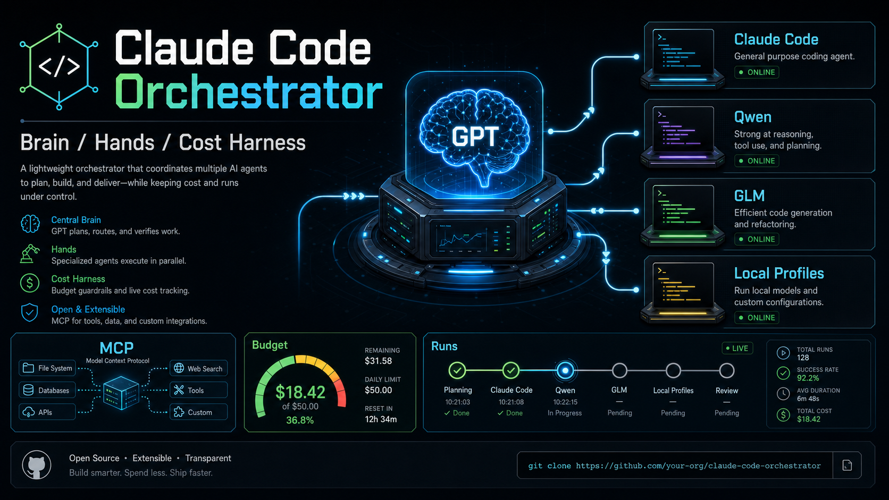
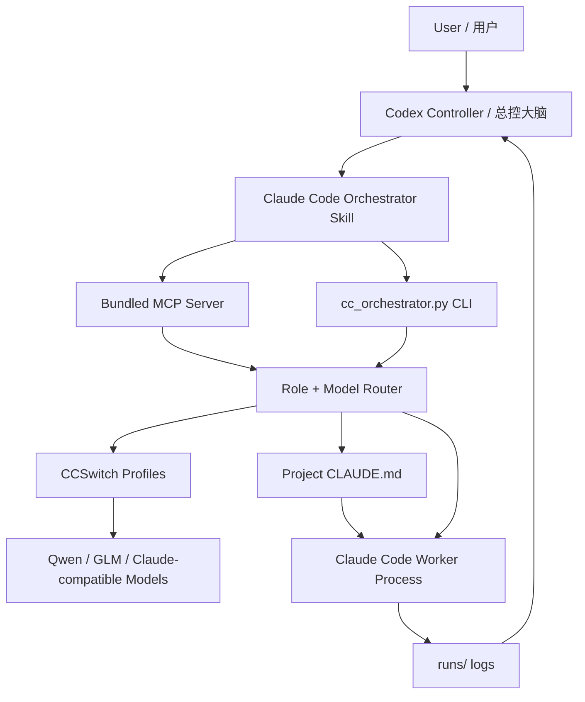

<p align="center">
  
</p>

<h1 align="center">Claude Code Orchestrator Skill</h1>

<p align="center">
  <b>一套把 Codex、Claude Code、CCSwitch 和多模型工人组织起来的世界级多 Agent 协作工程。</b>
</p>

<p align="center">
  <b>目标很直接：把它做成世界上最顶尖的多 Agent 协作工程。</b>
</p>

<p align="center">
  <b>让 Plus 的额度，用出 Pro 的效果。</b>
</p>

<p align="center">
  <b>A world-class multi-agent engineering harness for Codex, Claude Code, CCSwitch, and local model routing.</b>
</p>

<p align="center">
  <a href="README.md"></a>
  <a href="README.md"></a>
  <a href="LICENSE"></a>
  
  
  
</p>

---


<h2 align="center">中文版</h2>

众所周知，GPT / GPT Plus 很好用。

但现实问题也很直接：Plus 的额度不是无限的。

如果你在 Codex 里直接开很多子智能体，强模型会很快被烧光。

一次复杂项目拆解、一次多 Agent 审查、一次并行修复，就可能把本来很宝贵的额度消耗掉。

所以我做了这个 Skill。

它的目标就是：

> 让 Plus 的额度，用出 Pro 的效果。

所以这套 Skill 的思路是：

> 让最强、最好用的模型当“大脑”，负责判断、拆解、调度、验收；  
> 让 Claude Code 和 CCSwitch 里的多个模型当“手”，负责跑子任务、做分析、写代码、做测试、做审查。

换句话说：

> Codex 不再亲自干所有脏活累活。  
> Codex 负责做总控、做判断、做验收。  
> Claude Code 负责带着本地模型工人去执行。

这不是一个普通脚本。

这是一套微型成本管理学。

它把多 Agent 协作变成一条清楚的工程流水线：

```text
Codex = 总控大脑
Claude Code = 可调用工人
CCSwitch = 本地模型路由器
MCP = 标准控制接口
Skill = Codex 的操作说明书
```

最终目标很简单：

> 用最少的高端模型额度，撬动最多的工程产出。

<h2 align="center">它到底是什么</h2>

`claude-code-orchestrator-skill` 是一个 Codex Skill，里面自带一套 MCP Server 和 CLI。

它可以让 Codex 做这些事：

- 自动发现你电脑上的 Claude Code。
- 自动读取你电脑上的 CCSwitch 配置。
- 自动读取 CCSwitch 里配置好的多个模型。
- 给每个模型按角色打分。
- 给不同 Agent 角色选择最合适的模型。
- 用 Claude Code 启动外部子 Agent。
- 默认只读，避免乱改文件。
- 保存每个 Agent 的运行记录。
- 支持 MCP 工具调用。
- 支持可视 Claude Code 窗口。
- 支持中文、Windows、UTF-8 输出。
- 支持给项目写 `CLAUDE.md`，让 Claude Code 子 agent 有稳定人设和角色规则。

<h2 align="center">前置条件</h2>

必须先准备好这些东西：

1. **Codex**
   - 你需要在 Codex 里使用这个 Skill。

2. **Claude Code**
   - 本机必须能运行 Claude Code。
   - 命令行里最好能找到 `claude`。

3. **CCSwitch**
   - 本机必须安装 CCSwitch。
   - CCSwitch 里要配置好 Claude Code 可用的 provider。

4. **CCSwitch 里要有多个模型**
   - 例如：强代码模型、快模型、便宜模型、审查模型。
   - 模型越多，这套 Skill 的调度价值越大。

5. **Python 3.10+**
   - 用来跑 MCP Server 和 CLI。

最理想的配置是：

```text
Codex 已安装
Claude Code 已安装
CCSwitch 已安装
CCSwitch 里有多个模型
Claude Code 能走 CCSwitch 的 provider
```

<h2 align="center">一句话让 Agent 安装</h2>

把这句话丢给 Codex：

```text
请从 https://github.com/chu459/claude-code-orchestrator-skill 安装这个 Codex Skill 和自带 MCP。把 Skill 放到 ~/.codex/skills/claude-code-orchestrator，把自带 MCP 写进 Codex config.toml，然后运行 selftest、healthcheck、score-models，并把多 agent 路由策略展示给我。不要打印任何密钥。
```

English version:

```text
Install the Codex Skill and MCP server from https://github.com/chu459/claude-code-orchestrator-skill. Put the Skill at ~/.codex/skills/claude-code-orchestrator, wire the bundled MCP server into Codex config.toml, run selftest, healthcheck, score-models, and show me the selected multi-agent routing plan. Do not print secrets.
```

<h2 align="center">一行命令安装</h2>

Windows PowerShell：

```powershell
$tmp = Join-Path $env:TEMP "claude-code-orchestrator-skill.zip"; `
iwr -UseBasicParsing "https://github.com/chu459/claude-code-orchestrator-skill/archive/refs/heads/main.zip" -OutFile $tmp; `
$dir = Join-Path $env:TEMP "claude-code-orchestrator-skill"; `
if (Test-Path $dir) { Remove-Item $dir -Recurse -Force }; `
Expand-Archive $tmp -DestinationPath $dir -Force; `
& (Get-ChildItem $dir -Recurse -Filter install.ps1 | Select-Object -First 1).FullName
```

macOS / Linux：

```bash
tmp="$(mktemp -d)" && \
curl -L "https://github.com/chu459/claude-code-orchestrator-skill/archive/refs/heads/main.zip" -o "$tmp/skill.zip" && \
unzip -q "$tmp/skill.zip" -d "$tmp" && \
bash "$tmp"/claude-code-orchestrator-skill-main/install/install.sh
```

<h2 align="center">手动安装</h2>

```bash
git clone https://github.com/chu459/claude-code-orchestrator-skill.git
cd claude-code-orchestrator-skill
```

Windows：

```powershell
.\install\install.ps1
```

macOS / Linux：

```bash
bash install/install.sh
```

安装后会复制到：

```text
~/.codex/skills/claude-code-orchestrator
```

<h2 align="center">配置 MCP</h2>

把下面内容加到 Codex 的 `config.toml`：

```toml
[mcp_servers.claude-code-orchestrator]
command = "python"
args = [
  "-c",
  "import os,sys,runpy; home=os.environ.get('CODEX_HOME') or os.path.join(os.environ.get('USERPROFILE') or os.path.expanduser('~'), '.codex'); root=os.environ.get('CC_ORCHESTRATOR_HOME') or os.path.join(home, 'skills', 'claude-code-orchestrator', 'scripts', 'cc-orchestrator'); sys.path.insert(0, root); runpy.run_path(os.path.join(root, 'server.py'), run_name='__main__')"
]

[mcp_servers.claude-code-orchestrator.env]
PYTHONIOENCODING = "utf-8"
PYTHONUTF8 = "1"
```

同样的配置也在：

```text
docs/mcp.codex.example.toml
```

<h2 align="center">快速自检</h2>

```powershell
$env:CC_ORCHESTRATOR_HOME = "$env:USERPROFILE\.codex\skills\claude-code-orchestrator\scripts\cc-orchestrator"
python "$env:CC_ORCHESTRATOR_HOME\cc_orchestrator.py" selftest
python "$env:CC_ORCHESTRATOR_HOME\cc_orchestrator.py" healthcheck
python "$env:CC_ORCHESTRATOR_HOME\cc_orchestrator.py" score-models
python "$env:CC_ORCHESTRATOR_HOME\cc_orchestrator.py" workflow-plan "Refactor this project safely"
```

你应该看到：

- `selftest.ok = true`
- `healthcheck.ok = true`
- 能发现 CCSwitch profile
- 能列出 CCSwitch 里的模型
- 能生成多 Agent 路由计划

<h2 align="center">常用命令</h2>

健康检查：

```bash
python "$CC_ORCHESTRATOR_HOME/cc_orchestrator.py" healthcheck
```

列出 CCSwitch profiles：

```bash
python "$CC_ORCHESTRATOR_HOME/cc_orchestrator.py" list-profiles
```

给本机模型打分：

```bash
python "$CC_ORCHESTRATOR_HOME/cc_orchestrator.py" score-models
```

生成策略报告：

```bash
python "$CC_ORCHESTRATOR_HOME/cc_orchestrator.py" write-reports
```

给项目写 Claude Code 子 agent 人设文档：

```bash
python "$CC_ORCHESTRATOR_HOME/cc_orchestrator.py" write-claude-md --cwd /path/to/project --role implementation
```

跑一个只读 Agent：

```bash
python "$CC_ORCHESTRATOR_HOME/cc_orchestrator.py" run "Map this repository architecture" --role architecture
```

跑一个实时可轮询的后台 Agent：

```bash
python "$CC_ORCHESTRATOR_HOME/cc_orchestrator.py" run-streaming "Review this repository" --role review
```

轮询、查看、停止后台 Agent：

```bash
python "$CC_ORCHESTRATOR_HOME/cc_orchestrator.py" poll-run --run-id <run_id>
python "$CC_ORCHESTRATOR_HOME/cc_orchestrator.py" run-status
python "$CC_ORCHESTRATOR_HOME/cc_orchestrator.py" stop-run --run-id <run_id> --force
```

启动和汇总角色团队：

```bash
python "$CC_ORCHESTRATOR_HOME/cc_orchestrator.py" spawn-role-team "Audit this repository" --roles requirements,architecture,security,testing
python "$CC_ORCHESTRATOR_HOME/cc_orchestrator.py" collect-team-results --team-id <team_id>
python "$CC_ORCHESTRATOR_HOME/cc_orchestrator.py" cross-review --run-id <run_id> --run-id <run_id>
```

写入前检查和验收：

```bash
python "$CC_ORCHESTRATOR_HOME/cc_orchestrator.py" preflight-write-scope --cwd /path/to/project --allow src --deny .env --max-diff-lines 800
python "$CC_ORCHESTRATOR_HOME/cc_orchestrator.py" diff-summary --cwd /path/to/project
python "$CC_ORCHESTRATOR_HOME/cc_orchestrator.py" secret-scan-run --run-id <run_id>
```

模型调度和报告：

```bash
python "$CC_ORCHESTRATOR_HOME/cc_orchestrator.py" benchmark-model --profile PROFILE --execute
python "$CC_ORCHESTRATOR_HOME/cc_orchestrator.py" calibrate-policy --preference coding=glm-5 --preference multimodal=qwen3.7-plus
python "$CC_ORCHESTRATOR_HOME/cc_orchestrator.py" cost-guard --max-concurrent 4 --max-timeout-seconds 1200 --apply
python "$CC_ORCHESTRATOR_HOME/cc_orchestrator.py" dashboard
python "$CC_ORCHESTRATOR_HOME/cc_orchestrator.py" export-report --run-id <run_id>
```

打开可视 Claude Code 窗口：

```bash
python "$CC_ORCHESTRATOR_HOME/cc_orchestrator.py" run-visible "Inspect this repository" --role architecture
```

查看最后一次运行：

```bash
python "$CC_ORCHESTRATOR_HOME/cc_orchestrator.py" last-run
```

<h2 align="center">MCP 工具</h2>

这套 Skill 自带 MCP Server。

Codex 可以调用这些工具：

| Tool | 用途 |
| --- | --- |
| `cc_healthcheck` | 检查 Claude Code、CCSwitch、配置 |
| `cc_list_profiles` | 列出 CCSwitch profiles |
| `cc_pick_profile` | 给某个角色选择模型 |
| `cc_run_agent` | 跑一个 Claude Code 子 Agent |
| `cc_run_streaming_agent` | 启动带 `stream-json` 事件的后台 Claude Code worker |
| `cc_poll_run` | 查询某次 run 的状态、输出增量、工具调用、阶段和耗时 |
| `cc_stop_run` | 停止指定 run id 的 Claude Code worker |
| `cc_run_status` | 列出正在运行的 workers，或查看某个 run |
| `cc_send_instruction` | 通过“停止并带上下文重启”追加指令 |
| `cc_spawn_role_team` | 一次启动多个角色 worker |
| `cc_collect_team_results` | 汇总团队输出，标出一致结论和冲突风险 |
| `cc_cross_review` | 启动二轮交叉审查 worker |
| `cc_preflight_write_scope` | 写代码前固定允许目录、禁止文件和最大 diff |
| `cc_diff_summary` | 总结 diff 改了什么、风险在哪、是否需要测试 |
| `cc_secret_scan_run` | 扫描 run 日志、事件和 diff，防止密钥泄漏 |
| `cc_rollback_run` | 在 git 快照证明安全时保守回滚 |
| `cc_benchmark_model` | 运行或规划小任务模型实测 |
| `cc_calibrate_policy` | 固化本机模型偏好 |
| `cc_cost_guard` | 配置最大并发和超时护栏 |
| `cc_dashboard` | 生成本地 HTML worker 面板 |
| `cc_open_run_folder` | 打开或返回某次 run 日志目录 |
| `cc_export_report` | 导出 run 或 team 的 Markdown 报告 |
| `cc_run_visible_agent` | 打开可视 Claude Code 窗口 |
| `cc_last_run` | 查看最后一次运行 |
| `cc_git_diff` | 查看子 Agent 修改后的 diff |
| `cc_workflow_plan` | 生成多 Agent 工作流 |
| `cc_write_claude_md` | 给项目写 Claude Code 子 agent 的 `CLAUDE.md` 人设文档 |
| `cc_score_models` | 给本机模型打分 |
| `cc_write_strategy_reports` | 写出模型评分和调度报告 |

<h2 align="center">给 Claude Code 子 Agent 配置 CLAUDE.md</h2>

Claude Code 可以读取项目里的 `CLAUDE.md`。

这件事对多 agent 调度很重要。

因为 Codex 可以先给 Claude Code 写好人设、边界和角色规则，再让它作为外部子 agent 去干活。

生成的 `CLAUDE.md` 会告诉 Claude Code：

- Codex 是总控、规划者、审查者和最终决策者。
- Claude Code 是外部 worker。
- 当前角色是什么，比如 `architecture`、`implementation`、`review`。
- 不要泄露密钥，不要乱跑破坏性命令，不要回滚无关改动。
- 长任务要报告阶段和验证结果。

创建一个：

```bash
python "$CC_ORCHESTRATOR_HOME/cc_orchestrator.py" write-claude-md --cwd /path/to/project --role review
```

如果项目里已经有 `CLAUDE.md`，默认不会覆盖：

- 默认：不覆盖。
- `--append`：追加一段 orchestrator 托管内容。
- `--force`：先备份，再替换。

通过 MCP，Codex 可以调用：

```text
cc_write_claude_md
```

推荐流程：

```text
1. Codex 先规划任务
2. Codex 给对应角色写 CLAUDE.md
3. Codex 通过这个 Skill 启动 Claude Code
4. Claude Code 按项目人设和角色规则执行
5. Codex 审查日志、diff 和最终输出
```

<h2 align="center">多 Agent 角色</h2>

默认角色：

| Role | 作用 |
| --- | --- |
| `requirements` | 需求、边界、验收标准 |
| `architecture` | 架构、文件、风险、方案 |
| `security` | 密钥、权限、破坏性操作、安全风险 |
| `testing` | 测试计划、验证命令、残余风险 |
| `implementation` | 受控写代码 |
| `review` | 代码审查、问题排序 |
| `ops` | 部署、日志、回滚、运行风险 |

<h2 align="center">成本管理学：大脑和手</h2>

这套 Skill 的核心不是“多开几个 Agent”。

核心是：

```text
大脑：最强模型，负责判断和验收
手：多个更便宜、更快、额度更充足的模型，负责执行
账本：每个 run 都有 metadata、stdout、stderr
总控：Codex 决定谁做什么，什么时候停
```

这就是微型成本管理学。

不是让所有模型乱跑。

而是把每个模型放到它最划算的位置。

<h2 align="center">架构图</h2>



<h2 align="center">安全默认值</h2>

默认非常保守：

- 默认只读。
- 默认 `permission_mode = plan`。
- 只有显式 `allow_write=true` 才允许写文件。
- 不修改 CCSwitch 全局状态。
- 不打印 API Key。
- 日志里会做密钥脱敏。
- Windows 中文输出强制 UTF-8。
- 超时后尽量保留部分 stdout/stderr。
- 已有 `CLAUDE.md` 默认不覆盖，除非显式使用 `--append` 或 `--force`。

<h2 align="center">实时进度怎么看</h2>

当前可用方法：

1. 用 `run-streaming` 启动后台 Claude Code worker。
2. 用 `poll-run` 实时查看状态、输出增量、工具调用和阶段。
3. 用 `run-status` 查看所有正在运行的 workers。
4. 用 `stop-run` 停掉跑偏、卡住、成本异常的 worker。
5. 用 `run-visible` 打开 Claude Code 窗口。

Windows：

```powershell
Get-Content "$env:CC_ORCHESTRATOR_HOME\runs\<run_id>\stdout.txt" -Wait
Get-Content "$env:CC_ORCHESTRATOR_HOME\runs\<run_id>\events.ndjson" -Wait
```

macOS / Linux：

```bash
tail -f "$CC_ORCHESTRATOR_HOME/runs/<run_id>/stdout.txt"
tail -f "$CC_ORCHESTRATOR_HOME/runs/<run_id>/events.ndjson"
```

P0 实时掌控四件套已经可用：

```text
cc_run_streaming_agent
cc_poll_run
cc_stop_run
cc_run_status
```

这样 Codex 可以实时看到：

- 哪个 Agent 在跑
- 用的是哪个模型
- 跑了多久
- 当前阶段是什么
- 最近输出是什么
- 有没有超时风险
- 这次是不是太贵

完整想法见：

```text
docs/realtime-progress.md
```

<h2 align="center">开源定位</h2>

这套项目的目标很夸张：

> 成为世界上最顶尖的多 Agent 协作工程之一：强模型做大脑，便宜模型做手，Codex 做总控，MCP 做神经系统。

它不是为了炫技。

它是为了把真实工程里的模型成本、上下文成本、人工注意力成本，全都纳入调度。

<h2 align="center">Roadmap</h2>

- [x] Codex Skill
- [x] Bundled MCP Server
- [x] CCSwitch profile discovery
- [x] Local model scoring
- [x] Role-based model routing
- [x] Claude Code subprocess launching
- [x] Visible Claude Code window
- [x] UTF-8 safe Windows output
- [x] Run logs and `last-run`
- [x] `CLAUDE.md` worker persona writer
- [x] Live event stream with `events.ndjson`
- [x] Poll/stop/status tools for live control
- [x] Role team spawning and result collection
- [x] Cross-review worker loop
- [x] Preflight write-scope file
- [x] Diff summary and secret scan helpers
- [x] Conservative rollback helper
- [x] Model benchmark/calibration entrypoints
- [x] Cost guard policy
- [x] Local HTML dashboard
- [ ] Web dashboard
- [ ] Agent result voting

<h2 align="center">免责声明</h2>

This project is not affiliated with OpenAI, Anthropic, Claude, Claude Code, or CCSwitch.

请遵守你所使用模型、平台和工具的服务条款。

---
