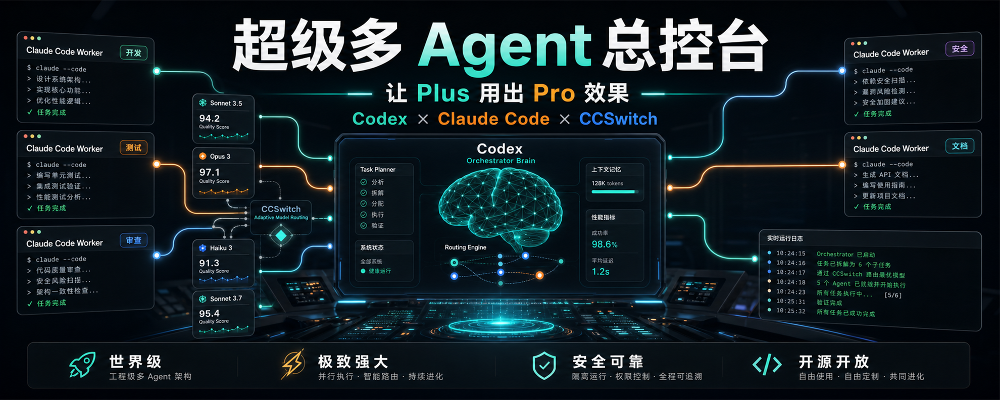

# 你有没有在 GPT 里开子智能体时，突然发现额度不够用了？



你有没有遇到过这种情况？

你本来只是想让 GPT / Codex 帮你做一个复杂任务。

比如拆一个开源项目。

比如审查一个仓库。

比如让几个子智能体分别去看需求、代码、测试、文档、安全。

一开始很爽。

多 Agent 一起跑，感觉像突然多了一个小团队。

但很快，一个很现实的问题来了：

**额度开始掉得飞快。**

尤其是 Plus。

强模型当然好用。

但强模型额度不是无限的。

你让它亲自拆任务，亲自读代码，亲自写文档，亲自跑测试，亲自做审查，亲自总结报告。

每一步都很聪明。

每一步也都很贵。

最后经常变成：

任务还没真正做完，额度先快见底了。

这件事让我很难受。

因为我并不是不想用强模型。

恰恰相反，我非常想用。

但我希望强模型用在最值钱的地方。

比如判断。

比如拆解。

比如路线选择。

比如最终验收。

而不是把最强的大脑，拿去干所有重复劳动。

所以我做了这个 Skill。

它叫：

**Claude Code Orchestrator Skill**

我对它的定位很夸张，也很认真：

> 这是一套超级无敌宇宙厉害的多 Agent 协作工程底座。

不是因为它花哨。

而是因为它解决了一个非常真实的问题：

> 怎么让最强模型当大脑，  
> 让其他模型当手，  
> 让 Codex 稳稳控制整条工程流水线。

## 我真正想做的东西

我不想再让一个模型硬扛所有事。

AI 编程如果一直停留在“我问一句，它答一句”，上限其实很明显。

复杂工程不是聊天。

复杂工程需要分工。

需要计划。

需要执行。

需要审查。

需要测试。

需要有人最后拍板。

所以我想要的不是“多开几个 Agent”。

我想要的是：

```text
Codex = 总控大脑
Claude Code = 外部工人
CCSwitch = 本机模型路由器
MCP = 标准控制接口
Skill = 让 Codex 知道怎么调度这一切
```

这套结构一旦跑起来，感觉就完全不一样。

Codex 不再是自己闷头干活。

它变成一个项目负责人。

它先判断任务。

再拆分角色。

再选择模型。

再派 Claude Code 工人出去干活。

最后回收日志、看结果、看 diff、看风险，再决定要不要接受。

这才像一个真正的多 Agent 工程系统。

## 为什么我说它是成本管理学

很多人理解多 Agent，会理解成：

> 多开几个智能体，一起干活。

但我觉得这还不够。

真正关键的是：

> 每个模型，都应该放在它最划算的位置。

有些任务需要强推理。

有些任务只是整理文档。

有些任务适合快速扫一遍。

有些任务必须谨慎审查。

如果所有任务都用最强模型，就像让老板去搬砖。

不是不能搬。

是太浪费。

所以这套 Skill 的本质，是一套微型成本管理系统。

让好模型做大脑。

让便宜、快、额度多的模型做手。

让 Codex 负责控制质量。

这就是我说的：

> 让 Plus 的额度，用出 Pro 的效果。

不是魔法。

是调度。

是分工。

是把模型能力放到正确的位置。

## 它到底怎么工作？

这个 Skill 会让 Codex 通过 MCP / CLI 控制 Claude Code。

它会先读取你电脑上的 CCSwitch 配置。

也就是说，它不是自己凭空编一套模型列表。

它会看你本机已经配置好的模型。

然后它会给模型按角色打分。

比如：

- 哪个模型更适合写代码。
- 哪个模型更适合做架构分析。
- 哪个模型更适合安全审查。
- 哪个模型更适合测试。
- 哪个模型更适合写文档。
- 哪个模型更适合跑快速任务。

然后 Codex 就可以按任务派工。

不是乱派。

而是按角色派。

比如一个复杂项目，可以这样拆：

- 需求 Agent：先判断到底要做什么。
- 架构 Agent：看项目结构和风险点。
- 开发 Agent：负责具体实现。
- 测试 Agent：找边界问题和复现路径。
- 审查 Agent：看代码质量和潜在 bug。
- 性能 Agent：看慢点和资源占用。
- 兼容 Agent：看 Windows / macOS / Linux 差异。
- 文档 Agent：写教程、FAQ、示例。
- 自动化 Agent：补 CI、打包、发布流程。
- 安全 Agent：查密钥、权限、危险命令。

这些 Agent 可以用不同模型。

但最后，Codex 还是总控。

Claude Code 的输出不会直接变成最终答案。

Codex 会复核。

这点非常重要。

因为没有总控的多 Agent，很容易变成一堆模型各说各话。

有了总控，它才像一支队伍。

## 我最喜欢的几个设计

第一个是默认只读。

默认情况下，worker 不会随便改你的文件。

它先分析，先计划，先输出建议。

只有你明确允许写入，它才进入改代码模式。

第二个是日志留存。

每次 Agent 跑完，都有 run 记录。

你可以看它跑了什么、输出了什么、有没有报错。

这对复盘非常重要。

第三个是密钥脱敏。

我不希望这种工具一边帮你自动化，一边把 API Key 写进日志。

所以它会尽量把敏感信息遮掉。

第四个是 `CLAUDE.md`。

Claude Code 本身支持项目级人设文档。

所以我让这个 Skill 可以给项目写 `CLAUDE.md`。

这样 Codex 在派 Claude Code 工人之前，可以先告诉它：

- 你是谁。
- 你负责什么角色。
- 哪些事不能做。
- Codex 才是总控。
- 结果必须交回 Codex 审查。

这就很像给外包团队先发一份工作规范。

不是让它自由发挥。

而是让它按规则干活。

## 它现在能做什么？

现在这套 Skill 已经包括：

- Codex Skill。
- 自带 MCP Server。
- 自带 CLI。
- 自动发现 Claude Code。
- 自动读取 CCSwitch。
- 读取本机模型配置。
- 模型按角色评分。
- 多 Agent 路由计划。
- Claude Code 子 Agent 启动。
- 可见 Claude Code 窗口。
- Windows 中文 / UTF-8 处理。
- run 日志保存。
- `last-run` 查看最近运行。
- `CLAUDE.md` 工人人设写入。
- 默认只读安全策略。
- 密钥脱敏。

它不是完美终局。

但它已经是一个能跑、能测、能复用的工程底座。

## 我为什么觉得它很有潜力？

因为 AI 编程一定会从“单模型回答”，走向“多 Agent 协作”。

但多 Agent 真正难的地方，不是 Agent 数量。

难的是调度。

谁先做？

谁后做？

谁适合做？

谁来检查？

谁来兜底？

谁能写文件？

谁只能读？

谁的结果可信？

哪里花了太多额度？

哪里应该换便宜模型？

这些问题不解决，多 Agent 只会变成更贵的聊天。

而我做这个 Skill，就是想把这些问题变成工程问题。

让 Codex 不是“聊天窗口”。

而是“控制台”。

让 Claude Code 不是“另一个助手”。

而是“可调度工人”。

让 CCSwitch 不只是“切模型工具”。

而是“模型路由层”。

这就是它真正厉害的地方。

## 谁适合用？

如果你只是偶尔让 AI 改一行代码，可能暂时用不到。

但如果你经常做这些事，它就很适合：

- 拆解开源项目。
- 做二开文档。
- 审查复杂代码仓库。
- 跑多个 Agent 做对照。
- 让 Claude Code 当子智能体。
- 想把 Codex 当总控。
- 想省强模型额度。
- 本机 CCSwitch 已经配置了多个模型。
- 想让 AI 编程流程更像工程团队。

尤其是你已经有 Codex、Claude Code、CCSwitch。

那这套 Skill 就会很顺。

因为它不是替代它们。

它是把它们组织起来。

## 怎么安装？

你可以直接把这句话丢给 Codex：

```text
Install the Codex Skill and MCP server from https://github.com/chu459/claude-code-orchestrator-skill. Put the Skill at ~/.codex/skills/claude-code-orchestrator, wire the bundled MCP server into Codex config.toml, run selftest, healthcheck, score-models, and show me the selected multi-agent routing plan. Do not print secrets.
```

前置条件很简单：

- Codex。
- Claude Code。
- CCSwitch。
- CCSwitch 里配置好多个模型。
- Python 3.10+。

装好后，让它跑：

```text
selftest
healthcheck
score-models
workflow-plan
```

如果这些都正常，你就能让 Codex 开始调度 Claude Code worker。

## 我后面还想做什么？

我想继续把它做成更完整的多 Agent 控制台。

后面可以加：

- 实时进度流。
- 终端仪表盘。
- Web 看板。
- 多 Agent 并行调度。
- 自动交叉审查。
- 预算策略。
- worker 状态追踪。
- Agent 结果投票。
- 更细的模型评分。

我最想做的是实时进度。

也就是 Codex 可以看到：

- 哪个 Agent 正在跑。
- 用的是哪个模型。
- 当前跑到哪一步。
- 已经花了多久。
- 有没有超时。
- 最近输出了什么。
- 这次任务值不值得继续烧。

这样它就更像一个真正的工程总控台。

不是黑箱。

不是盲跑。

而是可观察、可复盘、可调度。

## 最后说人话

我做这个 Skill，是因为我真的觉得现在的 AI 编程需要升级。

不是再堆一个更聪明的模型。

而是把模型组织起来。

让强模型负责强判断。

让普通模型负责具体执行。

让 Codex 负责总控。

让 Claude Code 负责干活。

让 CCSwitch 负责选择合适的模型。

如果说以前是一个 AI 程序员在帮你写代码。

那我希望这个 Skill 带来的感觉是：

> 你有了一个 AI 工程团队。  
> 而 Codex 是那个项目总控。

项目地址：

https://github.com/chu459/claude-code-orchestrator-skill

如果你也遇到过“子智能体很好用，但额度烧太快”的问题，可以试试它。

让 Plus 的额度，用出 Pro 的效果。

